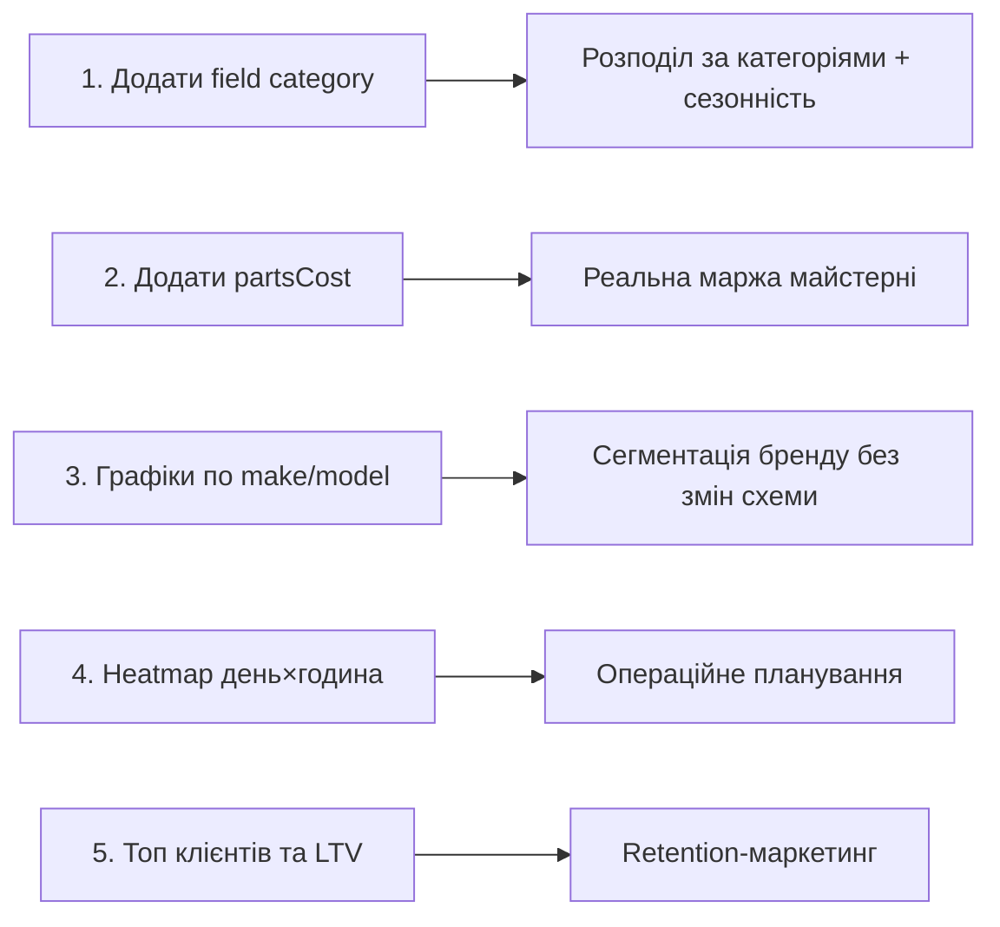

# Аналіз модуля статистики та пропозиції

## 📊 Що вже є в модулі статистики

Подивившись на `Statistics.tsx`, ось вичерпний список існуючих графіків:

| #  | Назва                          | Дані                                         | Розріз            |
| -- | ------------------------------ | -------------------------------------------- | ----------------- |
| 1  | **Звернення клієнтів**         | к-сть `problem` за день                      | тиждень / місяць  |
| 2  | **Фінанси**                    | сума `cost` рішень за день                   | тиждень / місяць  |
| 3  | **Рейт (грн/год)**             | `cost / spentHours` + к-сть рішень           | тиждень / місяць  |
| 4  | **Вартість vs Час**            | `cost` × `spentHours`                        | останні 10 рішень |
| 5  | **Час вирішення проблем**      | різниця `createdAt` problem ↔ solution       | min / avg / max   |
| 6  | **Складність vs Рейт**         | `difficulty (1–5)` × `cost / hours`          | всі рішення       |
| 7  | **Ефективність по днях тижня** | рейт по Пн–Нд                                | весь час          |
| 8  | **Розподіл вартості рішень**   | бакети `cost` (5 діапазонів)                 | весь час          |
| 9  | **Тренд середнього чеку**      | avg `cost` по тижнях                         | 8 тижнів          |
| 10 | **Топ авто**                   | сума `cost` за carId                         | top‑5             |
| 11 | **По місяцях (звернення)**     | к-сть problems                               | 6 міс             |
| 12 | **Загальна підсумкова**        | total / open / resolved                      | весь час          |

## 🗂 Які дані ми вже збираємо

**Car** (`types.ts`):
`plate, make, model, year, mileage, color, bodyType, clientName, clientPhone, note, createdAt, updatedAt, photoUrl, avatarUrl`

**HistoryEntry**:
`type (problem|solution|note|mileage), text, runtimeMileage, mileageDiff, authorId, linkedSolutionId, cost, spentHours, difficulty(1–5), createdAt, photoUrl, fileUrls[]`

**Ключове спостереження**: на 100% невикористаними у статистиці залишаються поля **`make`, `model`, `year`, `bodyType`, `color`, `clientName`, `clientPhone`, `mileage`, `runtimeMileage`, `mileageDiff`** — це величезний потенціал для нових інсайтів.

---

## 🚀 Нові графіки на існуючих даних

### 🚗 Сегментація по авто (`make`, `model`, `bodyType`, `color`, `year`, `mileage`)

1. [ ] **Топ марок за виручкою / кількістю звернень**
   Bar chart: групуємо solutions по `car.make`. Покаже, які бренди приносять більше роботи / грошей.
   *Інсайт:* спеціалізація — чи варто рекламуватися як «майстерня BMW».

2. [x] **Дохідність по марках/моделях** (avg check + rate ₴/год)
   Дві колонки на марку: середній чек і рейт. *Інсайт:* які марки вигідно брати в роботу, а які забирають час без прибутку.

3. [ ] **Розподіл по типу кузова** (donut chart: sedan / SUV / hatch / wagon …)
   *Інсайт:* портрет клієнтської бази → націлювання маркетингу.

4. [ ] **Вік авто vs к-сть проблем** (бакети: 0‑3 / 3‑7 / 7‑12 / 12+ років, обчислюється з `new Date().getFullYear() - car.year`)
   *Інсайт:* з яким віком авто найбільше роботи; коли «починає сипатися».

5. [ ] **Вік авто vs середній чек**
   Чи дорожчі ремонти в старих авто? *Інсайт:* ціноутворення для клієнтів з 15+ літніми авто.

6. [x] **Пробіг vs середній чек / к-сть візитів** (бакети `mileage`: <50k / 50‑100 / 100‑200 / 200‑300 / 300+)
   *Інсайт:* в якому діапазоні пробігу клієнт «приходить найчастіше і витрачає найбільше».

7. [x] **Інтервал між візитами** (`mileageDiff` distribution: <1k / 1‑5k / 5‑10k / 10‑20k / 20k+)
   *Інсайт:* частота повернень клієнтів, виявлення «зниклих» клієнтів.

### 👤 Сегментація по клієнтах (`clientPhone` як ключ — телефон надійніше за ім'я)

8. [ ] **Топ‑10 клієнтів за виручкою** (аналог «топ авто», але групування за `clientPhone`)
   *Інсайт:* VIP‑база, кому давати знижки/пріоритет.

9. [ ] **К-сть авто на клієнта** (1 / 2 / 3+)
   *Інсайт:* частка клієнтів з міні‑парком (потенціал для договорів обслуговування).

10. [ ] **Розподіл: нові vs повторні клієнти** (на основі першого `createdAt` клієнта)
    Donut chart + тренд по місяцях. *Інсайт:* retention vs acquisition.

11. [ ] **Lifetime Value по клієнту** (сума всіх solutions за `clientPhone` / період існування у БД)
    Histogram. *Інсайт:* скільки реально «коштує» клієнт у часі.

### ⏱ Часові патерни (з `createdAt`)

12. [x] **Heatmap день × година** (7×24 теплова карта створення `problem`)
    *Інсайт:* пікові години → коли тримати додаткового майстра.

13. [ ] **Сезонність по місяцях за 12 міс** (combo chart: к-сть problems + загальна виручка)
    *Інсайт:* осінь/весна сплеск, січень провал → планування відпусток / акцій.

14. [ ] **Сезонність по типах робіт** (зимою більше проблем з …) — наразі без категорії доведеться користуватись `bodyType`, але із додаванням поля `category` (див. нижче) стане дуже цікавим.

15. [x] **Aging відкритих проблем** (бакети: 1‑3 / 4‑7 / 8‑14 / 15‑30 / 30+ днів від `createdAt`, де `!linkedSolutionId`)
    *Інсайт:* «забуті» проблеми, що тягнуться → нагадування.

### 🎯 Складність та продуктивність

16. [x] **Розподіл складності** (donut 1–5) — скільки робіт якого рівня, *окремо від рейту*.

17. [x] **Складність × час виконання** (avg `spentHours` за рівнем)
    *Інсайт:* перевірка чи коректно проставляється difficulty (має бути позитивна кореляція з часом).

18. [x] **Складність × марка авто** (matrix / stacked bar)
    *Інсайт:* які бренди приносять складніші роботи.

### 💰 Фінанси та воронки

19. [ ] **Кумулятивна виручка з початку року** (line chart)
    *Інсайт:* прогрес vs план; одразу видно тренд.

20. [x] **Воронка: створено problems → linkedSolution → з cost > 0**
    *Інсайт:* конверсія діагностики в платну роботу.

21. [ ] **Загальний прибуток (не рейт) по днях тижня**
    Доповнює існуючий «Ефективність по днях» — деколи рейт високий, але обсяг низький.

22. [x] **Bubble chart: cost (Y) × hours (X) × difficulty (size) × make (колір)**
    Один графік замість трьох — повна картина рішень.

---

## ➕ Які поля додати для нових інсайтів

### У `HistoryEntry` (problem / solution)

| Поле                                   | Тип                                                                                  | Що дає                                                                              |
| -------------------------------------- | ------------------------------------------------------------------------------------ | ----------------------------------------------------------------------------------- |
| **`category`**                         | enum: `engine / transmission / brakes / electrical / suspension / body / diagnostic / maintenance / tires / hvac / other` | Найцінніше! Розподіл робіт за типом, сезонність категорій, рейт per category        |
| **`partsCost`**                        | number                                                                               | Розділення «запчастини» vs «робота» → реальна маржа майстерні                       |
| **`partsList`**                        | string[] / array of `{name, cost}`                                                   | Топ запчастин, прогноз закупівель                                                   |
| **`status`**                           | `new / in_progress / waiting_parts / done / cancelled`                               | Воронка, час очікування запчастин, KPI «в роботі»                                   |
| **`startedAt`** / **`finishedAt`**     | ISO date                                                                             | Розділення «час очікування» vs «час роботи» (зараз `createdAt` ≠ старт ремонту)     |
| **`isWarranty`** / **`reworkOf`** (id) | boolean / ref                                                                        | % повернень — критичний KPI якості                                                  |
| **`paymentStatus`**                    | `paid / partial / unpaid`                                                            | Cash-flow, дебіторка                                                                |
| **`paymentMethod`**                    | `cash / card / transfer`                                                             | Структура надходжень                                                                |
| **`discount`**                         | number                                                                               | Аналіз ефективності знижок                                                          |
| **`clientRating`**                     | 1–5                                                                                  | NPS / задоволеність по категоріях, по техніку                                       |
| **`technicianId`**                     | string                                                                               | Якщо в майстерні декілька рук — продуктивність по людях                             |
| **`tags`**                             | string[]                                                                             | Гнучка категоризація поверх `category`                                              |
| **`urgency`**                          | `low / normal / urgent`                                                              | Чи зростає рейт на термінових?                                                      |
| **`source`**                           | `referral / walk-in / repeat / google / instagram`                                   | Marketing ROI                                                                       |

### У `Car`

| Поле                                          | Тип                                              | Що дає                                                              |
| --------------------------------------------- | ------------------------------------------------ | ------------------------------------------------------------------- |
| **`fuelType`**                                | `petrol / diesel / hybrid / electric / lpg`      | Сегментація: чи дорожче ремонтувати дизель                          |
| **`transmission`**                            | `manual / automatic / cvt / dsg`                 | Розподіл, складність робіт                                          |
| **`engineVolume`**                            | number                                           | Кореляція з вартістю ремонту                                        |
| **`vin`**                                     | string                                           | Точна ідентифікація + інтеграція з зовнішніми сервісами             |
| **`nextServiceMileage`** / **`nextServiceDate`** | number / date                                  | Reminder-функціонал + статистика «прострочених ТО»                  |
| **`acquiredAt`** (дата першої появи у БД)     | date                                             | Окремо від `createdAt` запису                                       |

---

## 🌟 Нові графіки, які стануть можливими після додавання полів

1. [ ] **Розподіл проблем за категоріями** (donut + bar за рейтом)
2. [ ] **Маржа: запчастини vs праця** (stacked area по місяцях) — окремо `partsCost` і `cost - partsCost`
3. [ ] **Топ‑20 запчастин за обсягом використання** (з `partsList`)
4. [ ] **Сезонність категорій** (heatmap місяць × category — взимку акумулятори, влітку кондиціонер)
5. [ ] **Re‑work rate** — % робіт із `reworkOf != null` або `isWarranty=true` за період → KPI якості
6. [ ] **Воронка з реальним статусом**: `new → in_progress → waiting_parts → done` з конверсіями і часом на кожному етапі
7. [ ] **Час очікування запчастин** (avg `startedAt - createdAt` для статусу `waiting_parts`)
8. [ ] **Cash‑flow прогноз**: сума `paid` vs `unpaid` за період
9. [ ] **NPS / середня оцінка** (`clientRating`) + розбивка за категорією і техніком
10. [ ] **Продуктивність техніків** — рейт ₴/год, к-сть рішень, середня оцінка per `technicianId`
11. [ ] **ROI каналу залучення** (`source` × сума solutions для нових клієнтів) — куди вкладати в рекламу
12. [ ] **Знижки vs повторні візити** — чи приводять знижки до retention
13. [ ] **Пальне‑сегментація**: середній чек / категорії проблем для бензин vs дизель vs гібрид
14. [ ] **Прогноз навантаження** — на базі `nextServiceDate` + сезонності оцінити, скільки клієнтів приїде у наступному місяці

---

## 🎯 Що б я зробив першим (пріоритет)

**Без змін схеми** найшвидше реалізуються пункти **1–14** з першого розділу (марки, моделі, вік, пробіг, клієнти, heatmap, aging). Найбільшу віддачу за один доданий enum дасть `category` у `HistoryEntry` — він майже одразу розкриває половину інсайтів з другого списку.
