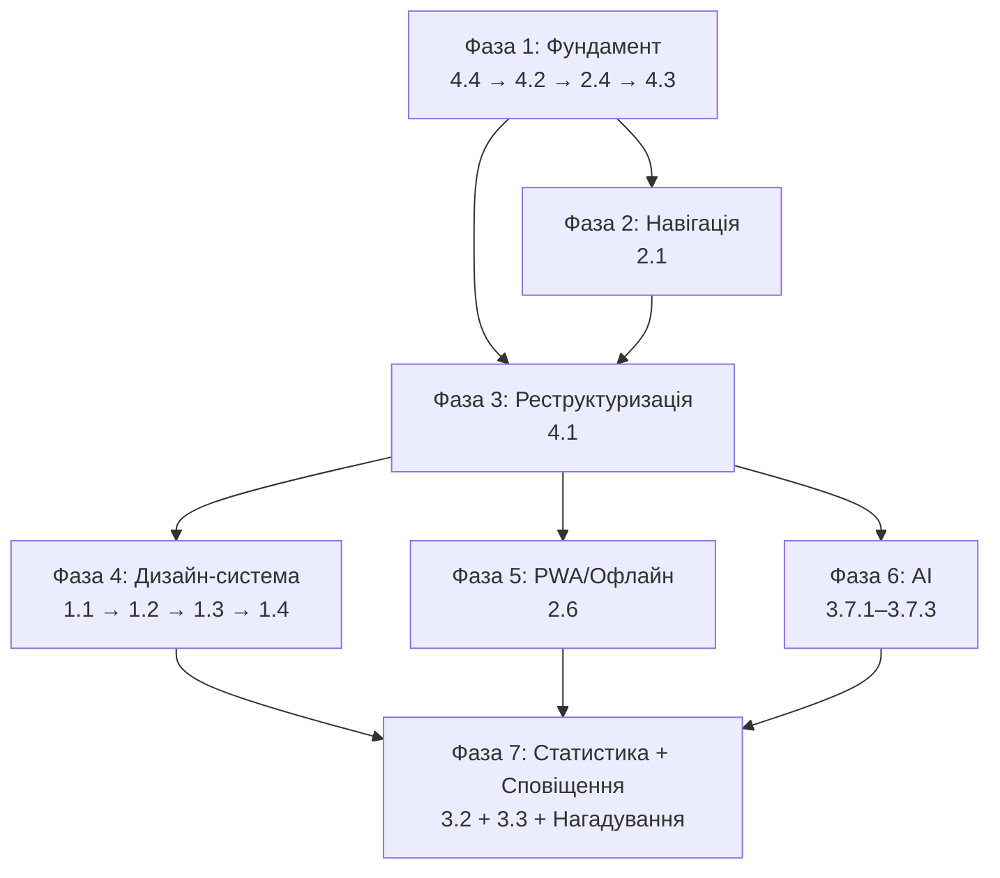

# 🗺️ АвтоБаза — Покроковий план реалізації (upgrade-plan.md)

> Реалізація обраних пунктів: **1.1–1.4, 2.1, 2.4, 2.6, 3.2, 3.3 + Нагадування, 3.7.1–3.7.3, 4.1–4.4**
> 
> **28 кроків** у **7 фазах**, впорядковані за залежностями для мінімізації переробок.

---

## Загальна карта залежностей



---

## Фаза 1 — Архітектурний фундамент

> **Чому першою?** Всі подальші зміни базуються на новій системі помилок, стану та хуках. Без цього кожна наступна фіча додаватиме технічний борг.

---

### Крок 1. Обробка помилок (4.4) — ✅ Виконано

**Пункти:** 4.4.1, 4.4.2, 4.4.3, 4.4.4

**Залежності:** немає

**Що робимо:**

1. **4.4.1 — Error Boundary** 
   - Рефакторинг існуючого `ErrorModal.tsx` (495 рядків, `@ts-nocheck`):
     - Видалити `@ts-nocheck`, типізувати весь файл
     - Розділити на 4 файли: `ErrorBoundary.tsx`, `ErrorContext.tsx`, `ErrorModal.tsx`, `errorUtils.ts`
   - `ErrorBoundary.tsx` — class component, обгортає `<App/>` у `main.tsx`
   - Fallback UI: кнопка «Перезавантажити» + кнопка «Скопіювати помилку»

2. **4.4.2 — Централізоване логування**
   - Створити `src/services/errorLogger.ts`
   - Функція `logError(error: unknown, context: string): void`
   - У production: зберігати у Firestore колекцію `errorLogs` (userId, message, stack, context, timestamp, userAgent)
   - У development: `console.error` з форматуванням
   - Оновити `firestore.rules`: додати правило для `errorLogs` (тільки create, без read/update/delete)

3. **4.4.3 — Стандартизація обробки помилок у services**
   - Створити тип `ServiceResult<T> = { data: T; error: null } | { data: null; error: AppError }`
   - Створити `AppError` клас з полями: `message`, `code`, `context`, `originalError`
   - Створити HOF `withErrorHandling<T>(fn: () => Promise<T>, context: string): Promise<ServiceResult<T>>`
   - Застосувати до всіх функцій у `storage.ts`, `ai.ts`

4. **4.4.4 — Retry-логіка**
   - Створити `retryAsync<T>(fn: () => Promise<T>, opts: { maxRetries: 3, delay: 1000, backoff: 2 }): Promise<T>`
   - Обробка 429 (rate limit) окремо: чекати `Retry-After` header
   - Застосувати до AI-викликів та Storage-операцій

**Створюються файли:**
- `src/shared/lib/errorBoundary.tsx`
- `src/shared/lib/errorContext.tsx`  
- `src/shared/lib/errorModal.tsx`
- `src/shared/lib/errorUtils.ts`
- `src/services/errorLogger.ts`
- `src/shared/lib/serviceResult.ts` (тип ServiceResult + withErrorHandling + retryAsync)

**Модифікуються:**
- `src/main.tsx` — імпорти нових файлів
- `src/services/ai.ts` — обгортка withErrorHandling
- `src/services/storage.ts` — обгортка withErrorHandling
- `firestore.rules` — правило для errorLogs

**Критерій готовності:** `npm run lint` без помилок, ErrorBoundary ловить помилки рендеру, всі services повертають `ServiceResult<T>`.

---

### Крок 2. Управління станом (4.2) — ✅ Виконано

**Пункти:** 4.2.1, 4.2.2, 4.2.3

**Залежності:** Крок 1 (ErrorContext)

**Що робимо:**

1. **4.2.2 — AuthContext** (першим, бо від нього залежить AppContext)
   - Створити `src/shared/context/AuthContext.tsx`
   - Витягти з `AuthLayer.tsx`: `onAuthStateChanged`, стан `user`, `loading`, `loginError`
   - Експортувати хук `useAuth()`: повертає `{ user, loading, loginError, signIn, signOut }`
   - Рефакторинг `AuthLayer.tsx` → використовує `useAuth()` замість власного стану
   - Видалити render-prop паттерн `{(user) => ...}`, замінити на контекст

2. **4.2.1 — AppContext**
   - Створити `src/shared/context/AppContext.tsx`
   - Стан: `cars`, `selectedCarId`, `loading`
   - Методи: `fetchCars()`, `addCar()`, `updateCar()`, `deleteCar()`
   - Хук `useApp()`: повертає весь стан та методи
   - Рефакторинг `App.tsx`: видалити пропс-дрілінг cars/user, замінити на контексти

3. **4.2.3 — ThemeContext**
   - `ThemeProvider.tsx` вже використовує контекст — розширити:
     - Додати `useTheme()` хук (якщо ще не експортується)
     - Додати `systemTheme` detection через `matchMedia('(prefers-color-scheme: dark)')`
     - Додати метод `setAccentColor(colorId)` для програмної зміни

**Створюються:**
- `src/shared/context/AuthContext.tsx`
- `src/shared/context/AppContext.tsx`

**Модифікуються:**
- `src/components/AuthLayer.tsx` — використовує useAuth()
- `src/components/ThemeProvider.tsx` — розширення
- `src/App.tsx` — видалення props drilling, обгортка Providers
- `src/main.tsx` — порядок Providers: `ErrorBoundary > ErrorProvider > AuthProvider > ThemeProvider > AppProvider > Router > App`

**Критерій готовності:** Жоден компонент не отримує `user` через props, `cars` доступні через `useApp()`.

---

### Крок 3. Toast-система зворотнього зв'язку (2.4) — ✅ Виконано

**Пункти:** 2.4.1, 2.4.2, 2.4.3, 2.4.5, 2.4.6

**Залежності:** Крок 1 (ErrorContext), Крок 2 (контексти)

**Що робимо:**

1. **2.4.1 — Toast-система**
   - Створити `src/shared/ui/Toast.tsx` + `src/shared/context/ToastContext.tsx`
   - Типи: `success | error | info | warning`
   - Черга до 5 сповіщень, auto-dismiss: success 3с, error 5с, info 4с
   - Позиціювання: bottom-center, над safe-area-inset-bottom
   - Анімація: slide-up + fade-in (CSS only, без motion)
   - API: `useToast()` → `{ toast: { success(msg), error(msg), info(msg), warning(msg) } }`

2. **2.4.2 — Заміна alert()**
   - Знайти всі `alert()`, `window.alert()`, `window.confirm()`, `window.prompt()` у кодовій базі
   - Замінити на `toast.success()` / `toast.error()`
   - Для `confirm()` — створити `ConfirmDialog.tsx` (модальне вікно з «Так»/«Ні»)
   - Для `prompt()` — створити `PromptDialog.tsx` (модальне вікно з інпутом)

3. **2.4.3 — Skeleton loaders**
   - `CarCardSkeleton.tsx` — пульсуючий скелет картки авто
   - `CarProfileSkeleton.tsx` — скелет профілю
   - CSS-клас `.skeleton-pulse` у `index.css`: `@keyframes pulse`
   - Використати в `CarList.tsx` та `CarProfile.tsx` замість спіннера

4. **2.4.5 — Прогрес завантаження файлів**
   - Оновити `storage.ts`: функції upload повертають `{ progress: Observable, result: Promise }`
   - Створити `ProgressBar.tsx` компонент
   - Використати у `CarForm.tsx`, `HistoryEditModal.tsx`, `DiagnosticFiles.tsx`

5. **2.4.6 — Haptic Feedback**
   - Створити `src/shared/lib/haptic.ts`: `vibrate(pattern?: number[])` з перевіркою `navigator.vibrate`
   - Додати виклики при: видаленні, збереженні, помилці

**Створюються:**
- `src/shared/context/ToastContext.tsx`
- `src/shared/ui/Toast.tsx`
- `src/shared/ui/ConfirmDialog.tsx`
- `src/shared/ui/PromptDialog.tsx`
- `src/shared/ui/Skeleton.tsx`
- `src/shared/ui/ProgressBar.tsx`
- `src/shared/lib/haptic.ts`

**Модифікуються:**
- `src/main.tsx` — додати ToastProvider
- `src/index.css` — skeleton pulse animation
- Всі компоненти де є `alert()` / `confirm()` / `prompt()`
- `src/services/storage.ts` — прогрес завантаження
- `src/components/CarList.tsx` — skeleton замість spinner

**Критерій готовності:** Жодного `alert()` у кодовій базі, тоасти працюють на мобільному.

---

### Крок 4. Кастомні хуки (4.3) — ✅ Виконано

**Пункти:** 4.3.1–4.3.7

**Залежності:** Крок 2 (контексти), Крок 3 (toast)

**Що робимо:**

1. **4.3.1 — `useCars(userId)`** → `{ cars, loading, error, addCar, updateCar, deleteCar, fetchCars }`
   - Витягти з `AppContext` / `CarList.tsx` / `CarProfile.tsx`
   - Firestore `onSnapshot` підписка з cleanup

2. **4.3.2 — `useHistory(carId)`** → `{ history, loading, addEntry, updateEntry, deleteEntry }`
   - Витягти з `CarProfile.tsx` та `ServiceHistory.tsx`
   - Включити логіку створення/оновлення записів з файлами

3. **4.3.3 — `useVoiceRecognition(context)`** → `{ isRecording, isProcessing, start, stop, elapsed }`
   - Витягти з `VoiceAssistant.tsx`
   - MediaRecorder lifecycle, таймер, cleanup

4. **4.3.4 — `usePhotoAnalysis()`** → `{ analyze, isProcessing }`
   - Витягти з `PhotoAssistant.tsx`
   - Camera/gallery capture + AI call

5. **4.3.5 — `useFirebaseUpload()`** → `{ upload, progress, isUploading }`
   - Витягти зі `storage.ts`
   - Observable progress, cleanup

6. **4.3.6 — `useDebounce(value, delay)`** → debounced value
   - Утилітний хук для пошуку

7. **4.3.7 — `useLocalStorage(key, initial)`** → `[value, setValue]`
   - Збереження стану фільтрів, чернеток

**Створюються:**
- `src/shared/hooks/useCars.ts`
- `src/shared/hooks/useHistory.ts`
- `src/shared/hooks/useVoiceRecognition.ts`
- `src/shared/hooks/usePhotoAnalysis.ts`
- `src/shared/hooks/useFirebaseUpload.ts`
- `src/shared/hooks/useDebounce.ts`
- `src/shared/hooks/useLocalStorage.ts`
- `src/shared/hooks/index.ts` (barrel export)

**Модифікуються:**
- `src/components/CarList.tsx` — useDebounce
- `src/components/CarProfile.tsx` — useHistory, useCars  
- `src/components/VoiceAssistant.tsx` — useVoiceRecognition
- `src/components/PhotoAssistant.tsx` — usePhotoAnalysis

**Критерій готовності:** Бізнес-логіка відокремлена від JSX, хуки перевикористовуються між компонентами.

---

## Фаза 2 — Навігація

### Крок 5. React Router (2.1) — ✅ Виконано

**Пункти:** 2.1.1, 2.1.2, 2.1.3, 2.1.4

**Залежності:** Крок 2 (контексти — щоб не передавати props через router)

**Що робимо:**

1. **2.1.1 — Інтеграція react-router-dom v7**
   - `npm install react-router-dom`
   - Створити `src/router.tsx` з маршрутами:
     ```
     /              → CarList
     /car/new       → CarForm (isNew=true)
     /car/:id       → CarProfile
     /car/:id/edit  → CarForm (isNew=false)
     /stats         → Statistics (lazy loaded)
     /settings      → SettingsSheet (як overlay, не окремий маршрут)
     ```
   - Обгорнути App у `<BrowserRouter>` в `main.tsx`
   - Видалити ручний `history.pushState` / `popstate` з `App.tsx`
   - `App.tsx` → рендерить `<Outlet>` замість switch по `view` стану

2. **2.1.2 — Кнопка «Назад»**
   - Автоматично працює з react-router
   - Додати `useNavigate()` замість `onBack` callback props
   - Видалити prop `onBack` з `CarProfile`, `Statistics`

3. **2.1.3 — Збереження скролу**
   - Додати `<ScrollRestoration>` від react-router
   - Або кастомно: зберегти `scrollTop` у `sessionStorage` з ключем route

4. **2.1.4 — Заголовок сторінки**
   - Створити `src/shared/ui/PageHeader.tsx`
   - Props: `title`, `onBack?`, `actions?` (слот для кнопок)
   - Автоматичний `document.title` на основі маршруту
   - Використати у `CarProfile`, `Statistics`, `CarForm`

**Створюються:**
- `src/router.tsx`
- `src/shared/ui/PageHeader.tsx`

**Модифікуються:**
- `package.json` — додати react-router-dom
- `src/main.tsx` — BrowserRouter
- `src/App.tsx` — повний рефакторинг (видалення view state, додавання Routes)
- `src/components/CarList.tsx` — `navigate('/car/new')` замість `onAddNew()`
- `src/components/CarProfile.tsx` — `navigate(-1)` замість `onBack()`
- `src/components/Statistics.tsx` — `navigate(-1)` замість `onBack()`
- `firebase.json` — додати rewrites для SPA: `"rewrites": [{"source": "**", "destination": "/index.html"}]`

**Критерій готовності:** Всі сторінки мають URL, кнопка «Назад» браузера працює, перезавантаження сторінки повертає на ту ж view.

---

## Фаза 3 — Реструктуризація коду

### Крок 6. Feature-based структура папок (4.1.1) — ✅ Виконано

**Залежності:** Крок 5 (router — щоб знати фінальні маршрути)

**Що робимо:**

Створити нову структуру і перемістити файли **по одній feature за раз**, оновлюючи імпорти після кожного переміщення:

```
src/
├── features/
│   ├── auth/
│   │   └── AuthLayer.tsx
│   ├── cars/
│   │   ├── CarList.tsx
│   │   ├── CarCard.tsx
│   │   ├── CarForm.tsx
│   │   ├── CarProfile.tsx
│   │   ├── LicensePlate.tsx
│   │   └── components/          ← під-компоненти (створюються у кроках 7-10)
│   ├── history/
│   │   ├── ServiceHistory.tsx
│   │   ├── HistoryEditModal.tsx
│   │   ├── TextHistoryInput.tsx
│   │   └── components/
│   ├── stats/
│   │   ├── Statistics.tsx       ← тимчасово, розбивається у кроці 8
│   │   └── charts/
│   ├── ai/
│   │   ├── VoiceAssistant.tsx
│   │   ├── PhotoAssistant.tsx
│   │   └── DiagnosticFiles.tsx
│   └── settings/
│       ├── SettingsSheet.tsx
│       └── InstructionSheet.tsx
├── shared/
│   ├── ui/                      ← вже створено у кроках 1-3
│   ├── icons/
│   │   └── Icons.tsx
│   ├── hooks/                   ← вже створено у кроці 4
│   ├── context/                 ← вже створено у кроці 2
│   └── lib/
│       ├── utils.ts
│       ├── errorBoundary.tsx
│       ├── errorContext.tsx
│       ├── errorModal.tsx
│       ├── errorUtils.ts
│       ├── serviceResult.ts
│       └── haptic.ts
├── services/
│   ├── firebase.ts
│   ├── storage.ts
│   ├── ai.ts
│   └── errorLogger.ts
├── types/
│   ├── car.ts
│   ├── history.ts
│   └── index.ts
├── App.tsx
├── router.tsx
├── main.tsx
└── index.css
```

**Порядок переміщення (щоб мінімізувати кількість зламаних імпортів):**
1. Створити всі папки
2. Перемістити `types.ts` → `types/` (розбити на car.ts, history.ts)
3. Перемістити `services/*` (шляхи не змінюються)
4. Перемістити shared/ файли (вже на місці з кроків 1-4)
5. Перемістити features/ по одній групі: auth → cars → history → stats → ai → settings
6. Оновити `tsconfig.json` path aliases: `@shared/*`, `@features/*`, `@services/*`, `@types/*`
7. Оновити всі імпорти

**Критерій готовності:** `npm run build` успішний, `npm run lint` без помилок, всі файли у нових місцях.

---

### Крок 7. Розбиття CarProfile (4.1.4) + CarForm (4.1.5) — ✅ Виконано

**Залежності:** Крок 6

**Що робимо:**

**CarProfile.tsx (533 рядків) → 4 файли:**
- `features/cars/CarProfile.tsx` — orchestrator, ~150 рядків
- `features/cars/components/CarInfoCard.tsx` — карта авто з аватаркою, ~100 рядків
- `features/cars/components/CarAvatarSection.tsx` — зона аватара, генерація, ~80 рядків
- `features/cars/components/MileageToast.tsx` — тост оновлення пробігу, ~50 рядків

**CarForm.tsx (337 рядків) → 4 файли:**
- `features/cars/CarForm.tsx` — основна форма, ~150 рядків
- `features/cars/components/AIFillSection.tsx` — секція AI-заповнення, ~60 рядків
- `features/cars/components/ColorPicker.tsx` — вибір кольору, ~40 рядків
- `features/cars/components/BodyTypePicker.tsx` — вибір типу кузова, ~40 рядків

**Константи** `COLORS`, `BODY_TYPES` → `features/cars/constants.ts` (видалити cross-import з CarCard)

---

### Крок 8. Розбиття Statistics (4.1.2) — ✅ Виконано

**Залежності:** Крок 6

**Що робимо:**

**Statistics.tsx (2889 рядків!) → 15+ файлів:**

```
features/stats/
├── Statistics.tsx              ← orchestrator: period nav + chart grid (~200 рядків)
├── hooks/
│   ├── useStatsData.ts         ← Firestore підписки, обчислення базових даних
│   ├── usePeriodNav.ts         ← логіка тиждень/місяць, offset, навігація
│   └── useChartComputations.ts ← useMemo обчислення для графіків
├── components/
│   ├── PeriodNavigator.tsx     ← UI: тиждень/місяць toggle + < > навігація
│   ├── StatsDashboard.tsx      ← KPI-картки зверху
│   └── ChartCard.tsx           ← обгортка карткою для кожного графіку
└── charts/
    ├── RequestsChart.tsx        ← стовпчики звернень по днях
    ├── RateChart.tsx            ← рейт грн/год + к-сть рішень
    ├── CostTimeChart.tsx        ← вартість vs час (топ-10)
    ├── WeekdayEfficiency.tsx    ← ефективність по дням тижня
    ├── CostDistribution.tsx     ← гістограма вартості
    ├── AvgCheckTrend.tsx        ← тренд середнього чеку
    ├── TopCars.tsx              ← рейтинг авто за доходом
    ├── HeatmapChart.tsx         ← теплова карта день × година
    ├── AgingProblems.tsx        ← старіючі відкриті проблеми
    ├── DifficultyDonut.tsx      ← розподіл складності
    ├── DifficultyTimeChart.tsx  ← складність × час
    ├── DifficultyRateChart.tsx  ← складність vs рейт
    ├── DifficultyMakeChart.tsx  ← складність × марка
    ├── FunnelChart.tsx          ← воронка: problems → solutions → paid
    ├── BubbleChart.tsx          ← cost × hours × difficulty × make
    ├── MakeRevenueChart.tsx     ← дохідність по марках
    ├── MileageSegments.tsx      ← пробіг vs середній чек
    └── VisitInterval.tsx        ← інтервал між візитами
```

**Порядок:**
1. Витягти `usePeriodNav` + `PeriodNavigator` (навігація по тижнях/місяцях)
2. Витягти `useStatsData` (Firestore підписки)
3. Витягти графіки один за одним, починаючи з найпростіших
4. Statistics.tsx стає orchestrator: імпортує graphіки, рендерить grid

---

### Крок 9. Розбиття ServiceHistory (4.1.3) + HistoryEditModal (4.1.6) — ✅ Виконано

**Залежності:** Крок 6

**ServiceHistory.tsx (511 рядків) → 5 файлів:**
- `features/history/ServiceHistory.tsx` — контейнер, ~120 рядків
- `features/history/components/HistoryItem.tsx` — один запис, ~80 рядків
- `features/history/components/HistoryTimeline.tsx` — таймлайн-лінія + дати, ~60 рядків
- `features/history/components/LinkLines.tsx` — SVG зв'язки проблема↔рішення, ~100 рядків
- `features/history/components/LinkingMode.tsx` — режим створення зв'язків, ~50 рядків

**HistoryEditModal.tsx (400 рядків) → 4 файли:**
- `features/history/HistoryEditModal.tsx` — контейнер модалки, ~100 рядків
- `features/history/components/EditEntryForm.tsx` — універсальна форма, ~100 рядків
- `features/history/components/DifficultySelector.tsx` — вибір складності (перевикористовується з TextHistoryInput), ~40 рядків
- `features/history/components/FileAttachments.tsx` — прикріплення/перегляд файлів, ~80 рядків

**Усунення дублювання:**
- `isImageFile()`, `getFileName()` → `shared/lib/fileUtils.ts`
- `DifficultySelector` → перевикористовується у `TextHistoryInput` та `HistoryEditModal`

---

## Фаза 4 — Дизайн-система

> **Чому після реструктуризації?** UI-kit компоненти створюються у `shared/ui/`, дизайн-токени застосовуються до вже реструктуризованих компонентів — менше файлів для модифікації повторно.

### Крок 10. Дизайн-токени та кольорова система (1.1)

**Пункти:** 1.1.1–1.1.5

**Залежності:** Крок 6 (структура)

**Що робимо:**

1. **1.1.1 — HSL палітра з 10 градаціями**
   - У `index.css` створити CSS custom properties:
     ```css
     :root {
       --primary-50: ...; --primary-100: ...; ... --primary-900: ...;
       --neutral-50: ...; --neutral-100: ...; ... --neutral-900: ...;
       /* Статусні кольори */
       --status-problem: ...; --status-solution: ...; 
       --status-note: ...; --status-mileage: ...; --status-reminder: ...;
     }
     ```
   - Значення генеруються динамічно через `ThemeProvider` на основі обраного акценту

2. **1.1.2 — Нові кольорові акценти**
   - Додати у ThemeProvider: Amber, Teal, Rose, Slate, Cyan, Indigo
   - Кожен акцент = набір HSL-значень для light та dark mode
   - Оновити `SettingsSheet.tsx`: нові превью-кольори у сітці

3. **1.1.3 — WCAG AA контрастність**
   - Аудит: для кожної пари background/foreground перевірити контраст
   - Створити утиліту `contrastCheck(bg, fg)` для розробки
   - Оновити занадто блідий текст у dark mode

4. **1.1.4 — AMOLED тема**
   - Третій варіант теми: `light | dark | amoled`
   - AMOLED: `--background: 0 0% 0%`, `--card: 0 0% 5%`, `--border: 0 0% 12%`
   - Оновити `ThemeProvider` та `SettingsSheet`

5. **1.1.5 — Уніфікація статусних кольорів**
   - CSS custom properties `--status-*` що працюють в обох темах
   - Використати у `ServiceHistory`, `CarCard`, `Statistics`

**Модифікуються:**
- `src/index.css` — design tokens
- `src/shared/context/ThemeContext.tsx` або `ThemeProvider.tsx`
- `src/features/settings/SettingsSheet.tsx`
- Всі компоненти з хардкодованими кольорами

---

### Крок 11. Типографіка (1.2)

**Пункти:** 1.2.1–1.2.3

**Залежності:** Крок 10 (design tokens)

**Що робимо:**

1. **1.2.1 — Google Font Inter**
   - Додаток уже імпортує Inter через `@import url(...)` у CSS — перевірити що `font-display: swap` додано
   - Додати шрифт у PWA precache (vite-plugin-pwa workbox config)
   - Переконатися що fallback `system-ui` є

2. **1.2.2 — Type scale**
   - CSS custom properties:
     ```css
     --text-xs: 0.75rem;    /* 12px */
     --text-sm: 0.875rem;   /* 14px */
     --text-base: 1rem;     /* 16px */
     --text-lg: 1.125rem;   /* 18px */
     --text-xl: 1.25rem;    /* 20px */
     --text-2xl: 1.5rem;    /* 24px */
     --text-3xl: 1.875rem;  /* 30px */
     --line-height-tight: 1.25;
     --line-height-normal: 1.5;
     --line-height-relaxed: 1.75;
     --font-weight-normal: 400;
     --font-weight-medium: 500;
     --font-weight-semibold: 600;
     --font-weight-bold: 700;
     ```
   - Рефакторинг: замінити `text-[14px]`, `text-[12px]` на токени

3. **1.2.3 — Моноширинний шрифт**
   - JetBrains Mono вже підключено (видно в index.css) — використати для:
     - `LicensePlate.tsx` — номерний знак
     - Числові значення: пробіг, вартість, телефон

---

### Крок 12. Іконки (1.3)

**Пункти:** 1.3.1–1.3.4

**Залежності:** Крок 6 (Icons.tsx переміщено у shared/icons/)

**Що робимо:**

1. **1.3.1 — Аудит та уніфікація SVG-іконок**
   - Відкрити `Icons.tsx`, перевірити кожну іконку:
     - viewBox: має бути `0 0 24 24`
     - strokeWidth: уніфікувати до `1.8` або `2`
     - Стиль: outline (stroke, без fill) — для консистентності
   - Перерисувати іконки що не відповідають стандарту

2. **1.3.2 — Нові іконки для станів**
   - `EmptyListIcon` — ілюстрація порожнього списку (авто)
   - `ErrorIcon` — ілюстрація помилки завантаження
   - `NoAvatarIcon` — placeholder для відсутнього аватара
   - `ReminderIcon` — дзвіночок для нагадувань (новий тип запису)
   - `NotificationIcon` — для сповіщень
   - `OfflineIcon` — для індикатора офлайн-режиму

3. **1.3.3 — Мікро-анімації іконок**
   - CSS-класи в `index.css`:
     ```css
     .icon-spin { animation: spin 1s linear infinite; }
     .icon-pulse { animation: pulse 2s ease-in-out infinite; }
     .icon-shake { animation: shake 0.5s ease-in-out; }
     .icon-check { animation: check-draw 0.3s ease-out forwards; }
     ```

4. **1.3.4 — Favicon та PWA іконки**
   - Генерувати з Logo.tsx: 16×16, 32×32, 192×192, 512×512, apple-touch-icon 180×180
   - Додати `maskable` варіант (з padding)
   - Оновити `vite.config.ts` PWA manifest

---

### Крок 13. UI-kit компоненти (1.4)

**Пункти:** 1.4.1–1.4.7

**Залежності:** Крок 10 (design tokens), Крок 11 (типографіка), Крок 12 (іконки)

**Що робимо:**

1. **1.4.1 — Базовий UI-kit**
   Створити у `src/shared/ui/`:
   - `Button.tsx` — варіанти: primary, secondary, ghost, danger, icon-only; розміри: sm, md, lg
   - `Input.tsx` — з лейблом, помилкою, prefix/suffix іконками
   - `Select.tsx` — стилізований select з іконкою
   - `Textarea.tsx` — автозростаючий
   - `Card.tsx` — з header, body, footer слотами
   - `Badge.tsx` — кольорові бейджі для статусів
   - `Modal.tsx` — з overlay, close button, focus trap, Escape key
   - `BottomSheet.tsx` — для мобільних меню (використати для Settings, Instructions)

2. **1.4.2 — Border-radius токени**
   ```css
   --radius-sm: 6px; --radius-md: 10px; --radius-lg: 16px; --radius-xl: 24px; --radius-full: 9999px;
   ```

3. **1.4.3 — Тіні**
   ```css
   --shadow-xs: 0 1px 2px rgba(0,0,0,0.05);
   --shadow-sm: 0 1px 3px rgba(0,0,0,0.1);
   --shadow-md: 0 4px 6px rgba(0,0,0,0.1);
   --shadow-lg: 0 10px 15px rgba(0,0,0,0.1);
   --shadow-card: 0 2px 8px rgba(0,0,0,0.08);
   ```

4. **1.4.4 — Редизайн елементів історії**
   - Єдиний стиль `HistoryItem`: іконка + рамка на повну ширину + текст
   - Кольорова смуга зліва (як GitHub labels) замість фону
   - Тінь вибраного елемента: `box-shadow: 0 0 0 2px var(--primary-500), var(--shadow-md)`

5. **1.4.5 — Редизайн CarCard**
   - Backdrop-blur за аватаркою: `backdrop-filter: blur(8px)`
   - Gradient overlay: `linear-gradient(to right, var(--card) 60%, transparent)`
   - Чіткіше розділення: марка/модель зверху, клієнт знизу

6. **1.4.6 — Empty states**
   - `EmptyState.tsx` компонент: іконка + заголовок + опис + CTA-кнопка
   - Використати у CarList (порожній список), ServiceHistory (немає записів), Statistics (немає даних)

7. **1.4.7 — Редизайн CarForm**
   - Візуальні секції: «Дані авто», «Контакти клієнта», «AI-заповнення»
   - Кожна секція з заголовком та роздільником
   - Прогрес-бар: скільки полів заповнено з загальної кількості

**Створюються:**
- `src/shared/ui/Button.tsx`
- `src/shared/ui/Input.tsx`
- `src/shared/ui/Select.tsx`
- `src/shared/ui/Textarea.tsx`
- `src/shared/ui/Card.tsx`
- `src/shared/ui/Badge.tsx`
- `src/shared/ui/Modal.tsx`
- `src/shared/ui/BottomSheet.tsx`
- `src/shared/ui/EmptyState.tsx`
- `src/shared/ui/index.ts` (barrel export)

**Модифікуються:** практично всі компоненти — поступова заміна інлайн Tailwind на UI-kit компоненти.

**Критерій готовності:** Всі кнопки у додатку використовують `<Button>`, всі модалки — `<Modal>`, єдиний стиль скрізь.

---

## Фаза 5 — PWA та офлайн

### Крок 14. Офлайн-режим (2.6)

**Пункти:** 2.6.1–2.6.4

**Залежності:** Крок 4 (хуки), Крок 3 (toast для offline-індикації)

**Що робимо:**

1. **2.6.1 — Firestore offline persistence**
   - У `firebase.ts`:
     ```ts
     import { enableMultiTabIndexedDbPersistence } from 'firebase/firestore';
     enableMultiTabIndexedDbPersistence(db).catch(console.warn);
     ```
   - Тепер дані кешуються автоматично, `onSnapshot` працює офлайн

2. **2.6.2 — Індикатор online/offline**
   - Хук `useOnlineStatus()` у `shared/hooks/`:
     ```ts
     const [isOnline, setIsOnline] = useState(navigator.onLine);
     useEffect(() => {
       window.addEventListener('online', () => setIsOnline(true));
       window.addEventListener('offline', () => setIsOnline(false));
       return () => { ... cleanup };
     }, []);
     ```
   - У `PageHeader` або `App.tsx`: якщо offline → показати badge «Офлайн» з іконкою

3. **2.6.3 — Кешування зображень через SW**
   - Оновити `vite.config.ts` PWA workbox конфігурацію:
     ```ts
     runtimeCaching: [
       {
         urlPattern: /firebasestorage\.googleapis\.com/,
         handler: 'CacheFirst',
         options: {
           cacheName: 'firebase-images',
           expiration: { maxEntries: 200, maxAgeSeconds: 30 * 24 * 60 * 60 },
         }
       },
       {
         urlPattern: /fonts\.googleapis\.com/,
         handler: 'CacheFirst',
         options: { cacheName: 'google-fonts', expiration: { maxAgeSeconds: 365 * 24 * 60 * 60 } }
       }
     ]
     ```

4. **2.6.4 — Черга офлайн-мутацій**
   - Створити `services/offlineQueue.ts`:
     - Зберігати невиконані write-операції у IndexedDB
     - При відновленні з'єднання — виконати послідовно
     - Toast: «Дані будуть збережені при відновленні зв'язку»
   - Інтегрувати у хуки `useCars`, `useHistory`

**Створюються:**
- `src/shared/hooks/useOnlineStatus.ts`
- `src/services/offlineQueue.ts`

**Модифікуються:**
- `src/services/firebase.ts` — enablePersistence
- `vite.config.ts` — runtimeCaching
- `src/shared/ui/PageHeader.tsx` — offline badge

---

## Фаза 6 — AI-покращення

### Крок 15. AI-рекомендації при діагностиці (3.7.1)

**Залежності:** Крок 4 (хуки), Крок 9 (розбитий ServiceHistory)

**Що робимо:**

- Нова функція у `services/ai.ts`: `getRepairSuggestions(problem: string, make: string, model: string, year?: number): Promise<string[]>`
- Промт для Gemini:
  ```
  Ти — досвідчений автомайстер. На основі описаної проблеми з авто {make} {model} ({year}),
  запропонуй 3-5 можливих рішень. Враховуй типові несправності цієї марки.
  Відповідь дай українською мовою як JSON масив рядків.
  ```
- UI: кнопка «💡 Підказки AI» біля запису типу «проблема» у `HistoryItem.tsx`
- При натисканні → показати випадаючий блок з рекомендаціями
- Кожна рекомендація — кнопка «Створити рішення» → заповнити форму нового запису

---

### Крок 16. Автозаповнення вартості (3.7.2)

**Залежності:** Крок 15 (AI service patterns), Крок 4 (useHistory)

**Що робимо:**

- Нова функція у `services/ai.ts`: `suggestCost(workDescription: string, make: string, historicalSolutions: Solution[]): Promise<{ suggestedCost: number; reasoning: string }>`
- Алгоритм:
  1. Зібрати останні 50 рішень користувача з `useHistory`
  2. Знайти схожі роботи по тексту (fuzzy match або AI)
  3. Вирахувати середню/медіанну вартість
  4. Якщо схожих < 3 — використати Gemini для оцінки
- UI: у формі створення/редагування рішення, біля поля «Вартість»:
  - Підказка: «💡 Зазвичай ~X грн» (з локальних даних)
  - Кнопка «Заповнити» → встановити запропоновану вартість

---

### Крок 17. Аналіз фото пошкоджень (3.7.3)

**Залежності:** Крок 4 (usePhotoAnalysis), Крок 9 (FileAttachments)

**Що робимо:**

- Нова функція у `services/ai.ts`: `analyzeDamagePhoto(photoBase64: string, make?: string, model?: string): Promise<{ description: string; severity: 'minor' | 'moderate' | 'severe'; estimatedParts: string[] }>`
- Промт для Gemini Vision:
  ```
  Проаналізуй фото пошкодження автомобіля {make} {model}.
  Опиши: 1) Тип пошкодження 2) Ступінь серйозності 3) Можливі деталі для заміни.
  Відповідь українською у JSON.
  ```
- UI: при додаванні фото до проблеми/рішення — кнопка «🔍 Аналіз пошкодження»
- Результат показується під фото: опис, бейджі серйозності, список деталей

---

## Фаза 7 — Статистика, сповіщення та нагадування

> **Чому останньою?** Ці фічі потребують стабільної архітектури (хуки, контексти, UI-kit, FCM інфраструктуру).

### Крок 18. Розширення модулю статистики (3.2)

**Пункти:** 3.2.1–3.2.6

**Залежності:** Крок 8 (розбитий Statistics), Крок 13 (UI-kit)

**Що робимо:**

1. **3.2.2 — KPI-дашборд**
   - `StatsDashboard.tsx`: 4 картки зверху
     - Загальний дохід за період (↑↓ vs попередній)
     - Середній чек (↑↓)
     - Кількість клієнтів/звернень (↑↓)
     - Середній рейт грн/год (↑↓)
   - Дані з `useStatsData` хука

2. **3.2.4 — Порівняння періодів**
   - У `useStatsData`: завантажувати дані за поточний та попередній період паралельно
   - Delta-значення: `((current - previous) / previous * 100).toFixed(1)%`
   - Зелена стрілка ↑ або червона ↓ біля кожного KPI

3. **3.2.5 — Графік прогнозу доходу**
   - Новий чарт `ForecastChart.tsx`
   - Алгоритм: лінійна регресія по тижневих/місячних сумах за останні 8 періодів
   - Пунктирна лінія на 2-4 тижні вперед
   - Функція `linearRegression(points: [x, y][]): { slope, intercept }` у `shared/lib/math.ts`

4. **3.2.6 — Фільтр по марці/клієнту**
   - Dropdown `FilterBar.tsx` зверху сторінки статистики
   - Multi-select по марках авто
   - Фільтрація `allHistory` перед передачею у графіки

5. **3.2.3 — Експорт в CSV/PDF**
   - CSV: ручна генерація з масивів даних, `Blob` + `<a download>`
   - PDF: бібліотека `jsPDF` — скриншот Canvas графіків або табличний формат
   - Кнопка «📊 Експорт» у хедері статистики

---

### Крок 19. Push-сповіщення — FCM інфраструктура (3.3.1)

**Залежності:** Крок 2 (AuthContext)

**Що робимо:**

1. **Налаштування Firebase Cloud Messaging (client-side):**
   - У `firebase.ts`:
     ```ts
     import { getMessaging, getToken, onMessage } from 'firebase/messaging';
     export const messaging = getMessaging(app);
     ```
   - Створити `public/firebase-messaging-sw.js` — Service Worker для фонових сповіщень
   - Створити `services/notifications.ts`:
     - `requestNotificationPermission(): Promise<string | null>` — запит дозволу + отримання FCM token
     - `saveFcmToken(userId: string, token: string)` — зберегти у Firestore `users/{userId}/tokens`
     - `onForegroundMessage(callback)` — обробка повідомлень коли додаток відкритий

2. **UI запиту дозволу:**
   - При першому вході після логіну — toast «Увімкнути сповіщення?» з кнопкою «Увімкнути»
   - У Settings — toggle «Push-сповіщення» on/off

3. **Оновити Firestore rules:**
   - Дозволити запис у `users/{userId}/tokens` тільки для авторизованого користувача

---

### Крок 20. Нагадування про незакриті проблеми (3.3.2)

**Залежності:** Крок 19 (FCM)

**Що робимо:**

1. **Cloud Function `checkUnresolvedProblems`:**
   - Scheduled function (Cloud Scheduler): кожного ранку о 9:00
   - Логіка:
     - Для кожного користувача з FCM-токеном
     - Знайти проблеми без `linkedSolutionId` старше 3 днів
     - Згрупувати по авто
     - Надіслати FCM повідомлення: «У вас X незакритих проблем (авто: марка номер)»
   - Створити папку `functions/` з Firebase Cloud Functions

2. **Налаштування в Settings:**
   - Toggle: «Нагадувати про незакриті проблеми»
   - Вибір: через скільки днів нагадувати (1, 3, 7, 14)
   - Зберігати у Firestore `users/{userId}/settings`

---

### Крок 21. Тип запису «Нагадування» у історії (НОВИЙ)

**Залежності:** Крок 9 (розбитий ServiceHistory), Крок 19 (FCM), Крок 13 (UI-kit)

**Що робимо:**

1. **Модель даних:**
   - Додати новий тип `'reminder'` до `HistoryEntry.type`
   - Нові поля для reminder:
     ```ts
     interface HistoryEntry {
       // ... існуючі поля
       type: 'problem' | 'solution' | 'note' | 'mileage' | 'reminder';
       // Тільки для type === 'reminder':
       reminderDate?: string;        // ISO дата коли нагадати
       reminderTime?: string;        // HH:MM час нагадування
       reminderStatus?: 'pending' | 'sent' | 'dismissed'; // статус
       reminderRecurrence?: 'once' | 'daily' | 'weekly' | 'monthly' | null; // повторення
     }
     ```

2. **UI створення нагадування:**
   - У `TextHistoryInput.tsx` додати тип «🔔 Нагадування» до селектора типів
   - При виборі типу «Нагадування» показати:
     - Текстове поле (текст нагадування)
     - Date picker (нативний `<input type="date">`)
     - Time picker (нативний `<input type="time">`)
     - Select повторення: Одноразово / Щодня / Щотижня / Щомісяця
   - За замовчуванням: завтра о 9:00, одноразово

3. **UI відображення нагадувань у історії:**
   - Іконка: 🔔 дзвіночок
   - Колір статусу: `--status-reminder` (наприклад, amber/жовтий)
   - Бейджі: «Очікує» (жовтий), «Відправлено» (зелений), «Пропущено» (сірий)
   - Кнопка «Відхилити» / «Відкласти на 1 день»

4. **UI редагування нагадування:**
   - У `HistoryEditModal` — форма з тими ж полями що при створенні
   - Можливість змінити дату/час, текст, повторення

5. **Cloud Function `processReminders`:**
   - Scheduled: кожні 15 хвилин
   - Логіка:
     ```
     1. Знайти всі reminder записи де reminderStatus === 'pending'
        І reminderDate + reminderTime <= зараз
     2. Для кожного:
        a. Знайти авто (parent doc)
        b. Знайти FCM-токен власника
        c. Надіслати push:
           title: "🔔 Нагадування: {марка} {модель} ({номер})"
           body: "{текст нагадування}"
           data: { carId, entryId }
        d. Оновити reminderStatus → 'sent'
        e. Якщо recurrence !== 'once':
           - Створити наступний reminder з новою датою
     ```

6. **Обробка натискання на сповіщення:**
   - У `firebase-messaging-sw.js` → `notificationclick` event
   - Відкрити додаток на сторінці авто: `/#/car/{carId}`
   - У foreground: toast з кнопкою «Перейти»

7. **Оновити Firestore rules:**
   - Дозволити поля `reminderDate`, `reminderTime`, `reminderStatus`, `reminderRecurrence` для history entries
   - Cloud Function використовує admin SDK (не потребує rules)

**Створюються:**
- `functions/src/processReminders.ts`
- `functions/src/checkUnresolvedProblems.ts`
- `functions/package.json`, `functions/tsconfig.json`
- `public/firebase-messaging-sw.js`
- `src/services/notifications.ts`

**Модифікуються:**
- `src/types/history.ts` — новий тип + поля
- `src/features/history/TextHistoryInput.tsx` — тип «Нагадування»
- `src/features/history/components/HistoryItem.tsx` — відображення reminder
- `src/features/history/HistoryEditModal.tsx` — редагування reminder
- `firestore.rules` — нові поля
- `firebase.json` — Cloud Functions config

---

### Крок 22. Badge незакритих проблем на PWA (3.3.4)

**Залежності:** Крок 19 (FCM), Крок 4 (useCars)

**Що робимо:**

- У `AppContext` або `useCars`:
  ```ts
  useEffect(() => {
    const unresolvedCount = cars.reduce((sum, car) => sum + (car.unresolvedProblemsCount || 0), 0);
    if ('setAppBadge' in navigator) {
      navigator.setAppBadge(unresolvedCount || 0);
    }
  }, [cars]);
  ```
- Очищати badge при відкритті додатку: `navigator.clearAppBadge()`

---

| # | Крок | Пункти upgrade.md | Фаза | Залежить від | Оцінка складності | Статус |
|---|------|-------------------|------|-------------|-------------------|--------|
| 1 | Обробка помилок | 4.4.1–4.4.4 | 1 | — | 🟡 Середня | ✅ Виконано |
| 2 | Управління станом | 4.2.1–4.2.3 | 1 | Крок 1 | 🟡 Середня | ✅ Виконано |
| 3 | Toast-система | 2.4.1–2.4.6 | 1 | Крок 1, 2 | 🟡 Середня | ✅ Виконано |
| 4 | Кастомні хуки | 4.3.1–4.3.7 | 1 | Крок 2, 3 | 🟡 Середня | ✅ Виконано |
| 5 | React Router | 2.1.1–2.1.4 | 2 | Крок 2 | 🟡 Середня | ✅ Виконано |
| 6 | Feature-based структура | 4.1.1 | 3 | Крок 5 | 🔴 Висока | ✅ Виконано |
| 7 | Розбиття CarProfile/CarForm | 4.1.4, 4.1.5 | 3 | Крок 6 | 🟡 Середня | ✅ Виконано |
| 8 | Розбиття Statistics | 4.1.2 | 3 | Крок 6 | 🔴 Висока | ✅ Виконано |
| 9 | Розбиття ServiceHistory/HistoryEdit | 4.1.3, 4.1.6 | 3 | Крок 6 | 🟡 Середня | ✅ Виконано |
| 10 | Дизайн-токени та кольори | 1.1.1–1.1.5 | 4 | Крок 6 | 🟡 Середня | ⏳ Очікує |
| 11 | Типографіка | 1.2.1–1.2.3 | 4 | Крок 10 | 🟢 Низька | ⏳ Очікує |
| 12 | Іконки | 1.3.1–1.3.4 | 4 | Крок 6 | 🟢 Низька | ⏳ Очікує |
| 13 | UI-kit компоненти | 1.4.1–1.4.7 | 4 | Крок 10, 11, 12 | 🔴 Висока | ⏳ Очікує |
| 14 | Офлайн-режим та PWA | 2.6.1–2.6.4 | 5 | Крок 4 | 🟡 Середня | ⏳ Очікує |
| 15 | AI-рекомендації | 3.7.1 | 6 | Крок 4, 9 | 🟢 Низька | ⏳ Очікує |
| 16 | Автозаповнення вартості | 3.7.2 | 6 | Крок 15 | 🟢 Низька | ⏳ Очікує |
| 17 | Аналіз фото пошкоджень | 3.7.3 | 6 | Крок 4 | 🟢 Низька | ⏳ Очікує |
| 18 | Розширення статистики | 3.2.2–3.2.6 | 7 | Крок 8, 13 | 🟡 Середня | ⏳ Очікує |
| 19 | FCM інфраструктура | 3.3.1 | 7 | Крок 2 | 🟡 Середня | ⏳ Очікує |
| 20 | Нагадування незакритих проблем | 3.3.2 | 7 | Крок 19 | 🟡 Середня | ⏳ Очікує |
| 21 | Тип «Нагадування» + push | 3.3 + НОВИЙ | 7 | Крок 9, 19, 13 | 🔴 Висока | ⏳ Очікує |
| 22 | Badge PWA | 3.3.4 | 7 | Крок 19 | 🟢 Низька | ⏳ Очікує |

---

## Порядок виконання (рекомендований потік)

```mermaid
gantt
    title Послідовність реалізації
    dateFormat X
    axisFormat %s

    section Фаза 1: Фундамент
    Крок 1 Error Handling        :done, s1, 0, 2
    Крок 2 State Management      :done, s2, after s1, 2
    Крок 3 Toast System           :done, s3, after s2, 2
    Крок 4 Custom Hooks           :done, s4, after s3, 2

    section Фаза 2: Навігація
    Крок 5 React Router           :done, s5, after s2, 2

    section Фаза 3: Реструктуризація
    Крок 6 Feature Folders        :s6, after s5, 2
    Крок 7 Split CarProfile       :s7, after s6, 1
    Крок 8 Split Statistics       :s8, after s6, 3
    Крок 9 Split ServiceHistory   :s9, after s6, 2

    section Фаза 4: Дизайн
    Крок 10 Design Tokens         :s10, after s6, 2
    Крок 11 Typography            :s11, after s10, 1
    Крок 12 Icons                 :s12, after s6, 1
    Крок 13 UI Kit                :s13, after s11, 3

    section Фаза 5: PWA
    Крок 14 Offline               :s14, after s4, 2

    section Фаза 6: AI
    Крок 15 AI Suggestions        :s15, after s9, 1
    Крок 16 Cost Autofill         :s16, after s15, 1
    Крок 17 Damage Analysis       :s17, after s4, 1

    section Фаза 7: Stats + Notifications
    Крок 18 Extended Stats        :s18, after s8, 3
    Крок 19 FCM Setup             :s19, after s2, 2
    Крок 20 Unresolved Alerts     :s20, after s19, 2
    Крок 21 Reminders             :s21, after s19, 3
    Крок 22 PWA Badge             :s22, after s19, 1
```



> [!IMPORTANT]
> **Паралельні потоки:** Кроки 5+6 та 14 можна робити паралельно. Кроки 7, 8, 9 — паралельно між собою. Кроки 10-12 — частково паралельно. Це може суттєво скоротити загальний час.

> [!TIP]
> **Для початку реалізації** вкажіть номер кроку або діапазон: наприклад, `"реалізуємо крок 1"` або `"реалізуємо кроки 1-3"`.
